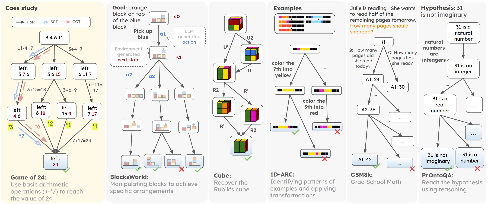

# Flow of Reasoning: Efficient Training of LLM Policy with Divergent Thinking

Official code for "[Flow of Reasoning: Efficient Training of LLM Policy with Divergent Thinking](https://arxiv.org/abs/2406.05673)" Also check our [[Project Page](https://yu-fangxu.github.io/FoR.github.io/)]



## Training & Inference


Our FoR formulates multi-step reasoning tasks as flow:
1. Design reward $R(s_n)$ of terminal states for different tasks.
2. Collect trajectories with the local search technique.
3. Training LLM policy $P_{F}$ with trajectory balance loss.

## Code
**1) Download this GitHub**
```
git clone https://github.com/Yu-Fangxu/FoR.git
```

**2) Prepare the environment**
We recommend conda for setting up a reproducible experiment environment. We include `environment.yaml` for creating a working environment:

```
bash install.sh
```

**3) Choose 1 of 3 tasks to run**
```
cd BlocksWorld|Game24|prontoqa
```

Check more detailed instructions in each branch.

## Citation
```
@article{yu2024flow,
  title={Flow of Reasoning: Efficient Training of LLM Policy with Divergent Thinking},
  author={Yu, Fangxu and Jiang, Lai and Kang, Haoqiang and Hao, Shibo and Qin, Lianhui},
  journal={arXiv preprint arXiv:2406.05673},
  year={2024}
}
```
